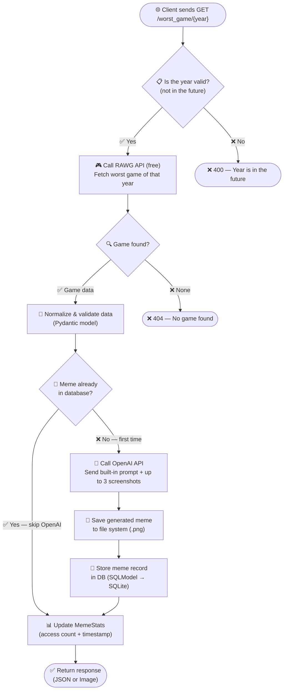

# 🎮 Worst Game Meme Generator

> *Enter a year. Receive a cursed meme about the game that made players question everything.*
---


---

## 💡 What Is This?

A **Python backend + data engineering** project disguised as a meme generator.

Under the fun surface, this app demonstrates a real-world data pipeline: it **ingests** raw data from an external API, **normalizes and validates** it into strict typed models, **transforms** images for AI consumption, **persists** results in a relational database, and **serves** everything through a clean REST API — with caching to avoid redundant work.

**What it does:**

1. **Fetches the worst-rated game** of any given year from the [RAWG Video Games API](https://rawg.io/apidocs)
2. **Normalizes raw API data** into validated Pydantic models (genres, release year, screenshots, metascore)
3. **Generates an AI meme** using OpenAI's `gpt-image-1` model — with a dynamically built prompt and real game screenshots
4. **Stores meme records** in a SQLite database via SQLModel, with file-based caching to skip expensive API calls on repeat requests
5. **Tracks access analytics** (view count, timestamps) powering a *Hall of Shame* leaderboard

All with ironic, slightly unhinged energy. 🔥

---

## 🔬 Backend + Data Engineering Flavor

This isn't just a simple API wrapper — it touches on real **data engineering** patterns:

| Concept | Where It Happens |
|---------|------------------|
| **Data ingestion** | Raw JSON fetched from the RAWG external API |
| **Data normalization** | API responses are parsed, cleaned, and mapped into strict Pydantic models (`RawgApiData`) — ensuring consistent types, extracting nested fields (genres, release year, screenshots) |
| **Data validation** | Pydantic v2 enforces type safety at every boundary — invalid data never reaches the business logic |
| **Data transformation** | Screenshots are downloaded, converted to `BytesIO` streams, and prepared for the OpenAI API format |
| **Caching / deduplication** | Memes are stored in SQLite on first generation — subsequent requests for the same year skip all external API calls and serve directly from the file system |
| **Access tracking & analytics** | Every meme request updates `MemeStats` (access count, last accessed timestamp) — enabling the Hall of Shame leaderboard |
| **Input sanitization** | Game names are sanitized into safe filenames via regex to prevent path issues |
| **Configuration management** | Environment variables managed through `pydantic-settings` with `.env` support — no hardcoded secrets |

---

## 🏗 Architecture



> **How caching works:** The RAWG API is called on every request (it's free and fast — we need the game data to build the file path). The **expensive OpenAI call** is the one that gets skipped when a meme already exists in the DB. On a cache hit, the saved `.png` is served directly — no image generation, no waiting. Caching the RAWG response was intentionally skipped — the call is free, lightweight, and always returns fresh data if game metadata changes over time.

### 🤖 A Note on Meme Generation

The prompt is **built dynamically** from real game data (title, genre, metascore, drop count, release year) and is carefully crafted to produce funny, readable meme images. It's not a simple one-liner — it includes detailed instructions for visual style, text placement, humor logic, and metascore badges.

---

## 🚀 Endpoints

| Method | Route | Description |
|--------|-------|-------------|
| `GET` | `/` | Welcome screen (serves the home image) |
| `GET` | `/worst_game/{year}` | Get the worst game of a year — as JSON or a generated meme image |
| `GET` | `/hall_of_shame` | Leaderboard of the most-accessed memes |

### `/worst_game/{year}`

| Parameter | Type | Description |
|-----------|------|-------------|
| `year` *(path)* | `int` | The year to look up |
| `format` *(query)* | `json` \| `image` | Response format (default: `json`) |

<details>
<summary>📦 Example JSON Response</summary>

```json
{
  "game_name": "Some Questionable Game",
  "game_meme": "http://localhost:8000/worst_game/2015?format=image"
}
```
</details>

### `/hall_of_shame`

Returns the most-viewed meme(s) — the games that were memed so hard they achieved immortality.
<details>
<summary>📦 Example JSON Response</summary>

```json
[
  {
    "game_name": "That One Game",
    "game_metascore": 42,
    "year": 2012,
    "image_url": "http://localhost:8000/worst_game/2012?format=image",
    "access_count": 15
  }
]
```
</details>
---

## 🛠 Tech Stack

| Layer | Technology |
|-------|-----------|
| **Language** | Python 3.14 |
| **Framework** | FastAPI + Uvicorn |
| **Validation** | Pydantic v2 |
| **Database** | SQLite via SQLModel |
| **AI / Image Gen** | OpenAI API (`gpt-image-1`) |
| **Game Data** | RAWG Video Games API |
| **Package Manager** | Poetry |
| **Linting** | Ruff |
| **Git Hooks** | pre-commit |

---

## ⚡ Quick Start

### Prerequisites

- Python 3.14
- [Poetry](https://python-poetry.org/)
- API keys for **RAWG** and **OpenAI**

### Setup

```bash
# Clone the repo
git clone https://github.com/AguxKuroko/game_project_tech_mentoring.git
cd game_project_tech_mentoring

# Install dependencies
poetry install
```

### Environment Variables

Create a `.env` file in the project root:

```env
RAWG_API_KEY=your_rawg_api_key_here
OPEN_AI_API_KEY=your_openai_api_key_here
```

### Run

```bash
poetry run uvicorn app.fast_api_endpoints:app
```

Then open [http://localhost:8000/docs](http://localhost:8000/docs) for the interactive Swagger UI.

---

## 📂 Project Structure

```
app/
├── fast_api_endpoints.py   # API routes & main FastAPI app
├── api_keys_config.py      # Environment-based config (Pydantic Settings)
├── app_config.py           # Paths & response format enum
├── meme_generator.py       # OpenAI image generation logic
├── models.py               # Pydantic models (RawgApiData, MemeGeneratorJsonData)
├── rawg_api.py             # RAWG API integration
├── utils.py                # Helpers: prompts, filename cleanup, lifespan
├── home_endpoint_image/
│   └── welcome.png         # Home screen image
└── db/
    ├── db_config.py        # Database URL config
    ├── db_models.py        # SQLModel tables (Meme, MemeStats)
    ├── db_utils.py         # UTC timestamp helper
    └── engine.py           # SQLModel engine setup
```

---

## 🥚 Easter Egg

There's a hidden mode buried in the code. If you're curious enough, dig through the source and find it yourself.

---

## 🧪 Development

```bash
# Run linting
poetry run ruff check .

# Run tests
poetry run pytest

# Install pre-commit hooks
poetry run pre-commit install
```

---

<p align="center">
  <i>Built with questionable taste during the <b>Tech Leaders Mentoring Program</b></i><br>
  <sub>Mentored by the one and only <a href="https://github.com/Dombearx">Dominik</a> 🐐</sub>
</p>
